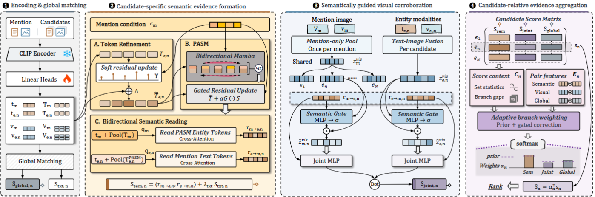

# Beyond Relevance: Mining and Prioritizing Diagnostic Evidence for Multimodal Entity Linking
This is the code of our paper: Beyond Relevance: Mining and PrioritizingDiagnostic Evidence for Multimodal EntityLinking.
<p align="center">
  
</p>

## Dependencies

We recommend using Conda to manage virtual environments, and we use Python version 3.10.

```bash
conda create -n vera python=3.10
conda activate vera
pip install -r requirements.txt
```
Please install the specified versions of Python libraries according to the requirements.txt file.


## Dataset
Download the datasets from [FissFuse dataset repository](https://github.com/pengfei-luo/FissFuse).
Create a data root directory at ./data/ and place the downloaded datasets under this directory.


## Running the code

`bash run.sh` starts the default WikiMEL VERA training run. `GPU` selects visible GPUs, `PYTHON` selects the Python executable, `DATASET` selects WikiMEL or WikiDiverse, and `CONFIG` overrides the selected YAML file.


